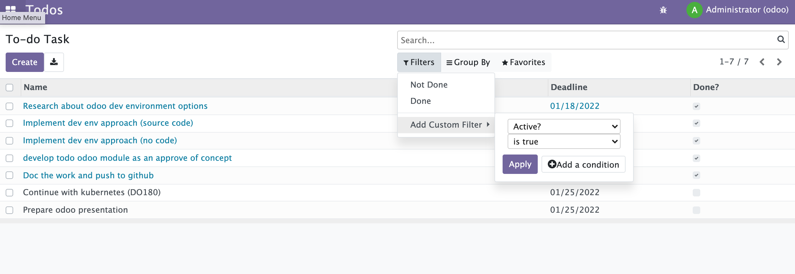

This is my first TODO module for odoo.



### Setup
--------------------------------------------------------------------------------
```bash
git clone git@github.com:haider-meshal/techiware.git odoo-env
cd odoo-env
git clone https://github.com/odoo/odoo.git repo-15
```

### Development from src (Run it locally: needs to setup pythons and dependencies)
--------------------------------------------------------------------------------
Run DB server:
```bash
docker-compose -f ./dev-source/odoo-db/server.yaml up -d
docker-compose -f ./dev-source/odoo-db/server.yaml stop
docker-compose -f ./dev-source/odoo-db/server.yaml down
```

[Optional] Run DB client:
```bash
docker-compose -f ./dev-source/odoo-db/client.yaml up -d
docker-compose -f ./dev-source/odoo-db/client.yaml stop
docker-compose -f ./dev-source/odoo-db/client.yaml down
```

Run run odoo and init:
```bash
./repo-15/odoo-bin -c ./dev-source/odoo.conf -i base
```

### Development without src (No python and dependencies needed)
-------------------------------------------------------------
```bash
docker-compose -f ./dev-no-source/docker-compose.yaml up -d
docker-compose -f ./dev-no-source/docker-compose.yaml stop
docker-compose -f ./dev-no-source/docker-compose.yaml down
```

Open [http://localhost:8069](http://localhost:8069) with your browser to see the result and login with admin/admin.
